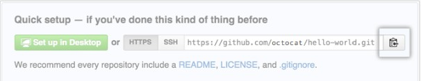

# Github指南

|版本|更新人员|更新日期|
|---|-------|-------|
|0.01|Shichao Wang|2017.04.25|
|0.02|Shichao Wang|2017.08.01|
|0.03|Shichao Wang|2017.10.24|

## 添加一个已有的工作目录至Github

1.在Github上新建一个仓库，但是不要初始化README，License和.gitignore文件

2.打开`Git bash`(其他也可以)

3.更改目录至需要上传的目录(如`cd d/workspace`)

4.`git init`

5.`git add -A`

6.`git commit -m "initial commit"`

7.回到Github网站，拷贝仓库的地址,可以见截图位置：



8.再回到命令行，输入以下命令：

``` bash
    git remote add origin 拷贝的仓库地址
    git remote -v
    git push -u origin master

```

## 更改远程仓库的地址

1.`git remote -v`, 获取当前的地址是什么

2.`git remote set-url origin <new url>`

## Host Key verification failed

1.`ssh-keygen -t rsa github.com >> ~/.ssh/know_hosts`

## fatal: refusing to merge unrelated histories

1. [stackoverflow上的解决方法](https://stackoverflow.com/questions/37937984/git-refusing-to-merge-unrelated-histories)

## [Github常见错误](http://www.jianshu.com/p/feb3a14c24ef)
