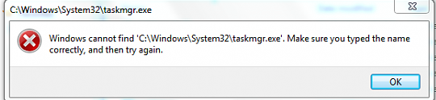

# 其他问题

|版本|更新人员|更新日期|更新内容|
|---|-------|-------|-------|
|0.01|Shichao Wang|2017.03.27|增加“安装软件出现error 2203”|
|0.02|Shichao Wang|2017.04.05|增加“网络无法连接，软件也无法打开”|
|0.03|Shichao Wang|2017.04.21|增加"计算机卡在左上角有个黑色的光标在闪烁的界面"|

## 安装软件出现 error 2203
> 这个问题多半会出现在安装.msi格式的软件

1. `开始` - `运行` - `%userprofile%\appdata\local`
2. 定位至`temp`目录
3. `右键` - `属性` - `安全` - `编辑` - `添加`，添加一个用户`system`，并将其权限设置为完全控制，保存
4. 再次尝试安装软件

## 网络无法连接，软件也无法打开
> 查看服务时发现很多本应该启动的服务也无法启动，尝试启动提示`错误的1747，未知的身份验证服务`

1. `win` + `r` 打开运行，键入`regedit`,回车打开注册表编辑器
2. 展开至`HKEY_LOCAL_MACHINE\SYSTEM\CurrentControlSet\Services\NDIS`, 在右侧的窗口中找到`ErrorControl`, 将值改为1(十六进制)
3. `win` + `r` 打开运行，输入`cmd`, 回车，在命令行下输入`netsh winsock reset`
4. 重启电脑

## 计算机卡在屏幕是黑色，屏幕左上角有个黑色的光标在闪烁
> 根据微软帮助文档的解释，系统分区是指包含加载 Windows 所需的硬件特定文件的分区，启动分区则是指包含 Windows 操作系统及其支持文件的分区，系统分区可以（但不是必须）与启动分区相同。
简单地说，系统分区就是保存引导文件的分区（也叫引导分区），启动分区则是 Windows 目录所在的分区。比如对于传统 BIOS 启动的 Windows 8 系统，如果系统是由 C:\bootmgr 文件引导，因为引导文件和 Windows 目录都在 C 盘，所以此时系统分区和启动分区是同一个分区即 C 盘

1. 进入PE
2. 使用`bcdedit`修改分区引导记录的目标分区为启动分区(即Windows所在的分区)
3. 重启即可恢复

## 任务管理器无法打开

1. 如上图所示，实际上我的系统是 `Windows 10`，这是从网上借来的 `Windows 7` 的图，但是错误是一样的，不影响。
2. 我的问题是由于使用 `Process Explorer` 来替代Task manager后感觉电脑很慢，所以你删除了前者，从而导致Task manager无法打开
3. 下面是解决问题的步骤：
    1. 打开注册表，定位这个路径：`HKLM\SOFTWARE\Microsoft\Windows NT\CurrentVersion\Image File Execution Options\taskmgr.exe`
    2. 删除这个这个路径的 `debugger` 值
4. 重新打开任务管理器

